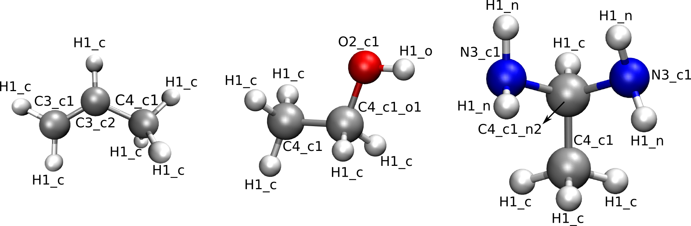

.. _seclab_ug_script:

Running QuickFF using qff.py
############################

T   he most straightforward use of QuickFF is by means of a single command using 
the :ref:`qff.py <seclab_rg_scripts_qff>` script. The basic usage of this script
is as follows::

    qff.py [options] fns

In the sections below, both the input files and the optional arguments are
discussed in detail. The description below is further illustrated with examples
in the :ref:`tutorials <seclab_tutorials>`.

.. _seclab_inputfiles:

Mandatory input files
=====================

The script requires input files describing the system and reference 
data. These files are provided to the program by means of the mandatory 
arguments `fns` which should be the names of the files in question. If multiple
files, information in later files overwrites information from earlier files. The 
following list enumerates all possible formats of these input files:

* **Gaussian formatted checkpoint file** (file.fchk): 

    a file generated using the 
    `formchk <http://www.gaussian.com/g_tech/g_ur/u_formchk.htm>`_ utility on a
    checkpoint file from a Gaussian 
    `freq <http://www.gaussian.com/g_tech/g_ur/k_freq.htm>`_ job. The atomic 
    numbers, equilibrium geometry and equilibrium Hessian are extracted from 
    this file.

* **vasprun file** (vasprun.xml):

    an `XML <https://www.w3.org/TR/REC-xml>`_ file generated by VASP during a
    frequency calculation.

* **MolMod checkpoint file** (file.chk)

    a file generated the `molmod.io.chk.dump` method from 
    `MolMod <http://molmod.github.com/molmod/>`_. This file contains arrays 
    representing data stored in a computer-friendly format. Each array is stored
    in the following format:
    
    .. code-block:: python
    
        tag                                     kind=dtype shape
        datanumber1       datanumber2       datanumber3       datanumber4
        datanumber5       datanumber6       datanumber7       datanumber8
        ...
        
    QuickFF will recognize and read arrays with the following tags: *energy*,
    *grad(ient)*, *hess(ian)*, *pos* (or *coords*), *rvecs* (or *cell*), 
    *bonds*, *ffatypes* and *ffatype_ids*

Optional input files
====================

* Electrostatic contribution (:option:`--ei=EI`):
    The user can define the electrostatic contribution of the force field using
    the option :option:`--ei=EI`. EI should be the file name of a Yaff parameter
    file containing the electrostatic contribution.

* Van der Waals contribution (:option:`--vdw=VDW`):
    The user can define the van der Waals contribution of the force field using
    the option :option:`--vdw=VDW`. VDW should be the file name of a Yaff 
    parameter file containing the van der Waals contribution.

* Residual covalent contribution (:option:`--covres=COVRES`):
    The user can define an `a priori` defined contribution to the covalent
    force field (and build a quickff force field on top of it) using the option
    :option:`--covres=COVRES`. QuickFF will not neglect terms already present 
    in the residual contribution, instead it will add an extra term for it. 
    COVRES should be the file name of a Yaff parameter file containing the 
    residual terms.

.. _seclab_ug_atype_estimator:

Automatic estimation of atom types
==================================
    
The optional argument :option:`--fflevel=LEVEL` will trigger the automatic 
assignation of atom types to every atom in the system. There are four possible 
levels of assignation:

    - *low*: atom type is based on atom number
    - *medium*: atom type is based on atom number and number of neighbors. 
    - *high*: atom type is based on atom number, number of neighbors and the atom number of those neighbors. 
    - *highest*: every single atom is given a unique atom type based on its index in the system.

The levels `medium` and `high` are the most usefull, `medium` will result in 
higher transferability of the force field parameters, while `high` will
result in higher accuracy. The levels `low` and `highest` are mostly usefull
for debugging purposes. The automatic assignation for the levels `medium` 
and `high` is illustrated for three different molecules in the figures 
below. If the level `medium` is chosen, atom type strings will be of the 
form *EN* in which *E* is the element and *N* is the number of neighbors. 
When choosing atom types according to the level `high`, atom type strings 
will be of the form *ENs* in which *E* is the element, *N* is the number 
of neighbors and *s* is a string describing the neighbors. If the atom has 
only 1 neighbor, then *s* is equal *_e* with *e* the element of the 
neighbor. If the atom under consideration has 2 neighbors, then *s* is equal
to *_ee* in which the first and second *e* represent the element of the 
first and second neighbor respectively. If the atom has more than 2 
neighbors, then *s* will contain a substring *_en* for every neighboring 
atom. In this substring, *e* represents the neighbor element and *n* is the
number of neighbors of that particular neighbor element. Multiple instances of 
this *_en* string are ordered according to atomic number.

.. figure:: atypes_medium.png
    :scale: 50 %
    :alt: Medium-level atom types
    :align: center
    
    **Figure 1**: Medium-level atom types

    
    **Figure 2**: High-level atom types

By default, the automatic assignation is switched off and the atom types are
suposed to be defined in the :ref:`input files <seclab_inputfiles>`.

Miscellanous options
====================

Through the use of the following options, the user can manipulate what QuickFF
will exactly do.

* Program mode (:option:`-m PROGRAM_MODE` or :option:`--program-mode=PROGRAM_MODE`):
    Specify the program mode which defines the set of instructions that will be
    executed. Allowed strings are the names of the program classes defined in
    the :ref:`program <seclab_rg_modules_program>` module. Be carefull, these
    names are case sensitive. By default, the program `DeriveNonDiagFF` will be
    used.

* Trajectory storing/loading (:option:`--fn-traj=FN_TRAJ`):
    Depending if the given option argument corresponds to an existing file or 
    not, this option will load/save perturbation trajectories to/from a cPickled 
    file.

* Construct specific trajectories (:option:`--only-traj=ONLY_TRAJ`):
    Construct the perturbation trajectory only for the terms with the given
    basenames. This options is only applied in the MakeTrajectories program.

* Output file suffix (:option:`--suffix=SUFFIX`):
    Suffix that will be added to all output files. By default, no suffix is 
    added.

* Plot energy (:option:`-e` or :option:`--ener-traj`):
    Plot the various energy contributions along the perturbation trajectories
    to. By default, energy plotting is switched off.

* Dump trajectories in XYZ format (:option:`-x` or :option:`--xyz-traj`):
    Dump the perturbation trajectories in XYZ format. By default, trajectory
    dumping is switched off.

Output
======

During the derivation of the force field, QuickFF will dump some usefull
information to the screen including machine information, system information, 
model information, the force field parameters after the perturbation step and
the final force field parameters. Additionally, three output files are
generated:

* system.chk:

    A MolMod checkpoint file containing all system information. This file can be
    used to start new QuickFF calculations or to perform force field simulations
    using `Yaff <http://molmod.github.io/yaff/>`_ together with the file 
    pars_yaff.txt.

* pars_yaff.txt:
    
    A formatted text file defining the final force field. This file can be read
    by `Yaff <http://molmod.github.io/yaff/>`_ together with the file 
    system.chk, to perform force field simulations.

Logging
=======

These options control the logging of all the operations in QuickFF.

* Silent mode (:option:`-s` or :option:`--silent`):
    Swith of all logging completely, overwrites all other verbosity options. By
    default, the silent mode is not activated.

* Verbose mode (:option:`-v` or :option:`--verbose`):
    Increases verbosity, is overwriten if :option:`--silent` is switched on. By
    default, the verbosity mode is not activated.

* Pipe logging (:option:`-l LOGFILE` or :option:`--logfile=LOGFILE`):
    Redirect logger output to a file with the name `LOGFILE`. By default, all
    logging output is printed to the screen.

Parallel QuickFF
================

If Scoop is installed, it is possible to run QuickFF on multiple cores of a 
single node by using the optional argument :option:`--scoop`. Only the 
generation of the perturbation trajectories will be parallized as it is by far
the time determening step. The exact syntax to use QuickFF in parallel is::

    python -m scoop -n nproc /path/to/qff.py --scoop [options] fns

*nproc* is the number of processes that can be launched simultaneously. It is
important to note that one has to define the absolute path to the location of 
the `qff.py` script. Finally, `[options]` and `fns` have the same meaning as
in the serial version.
